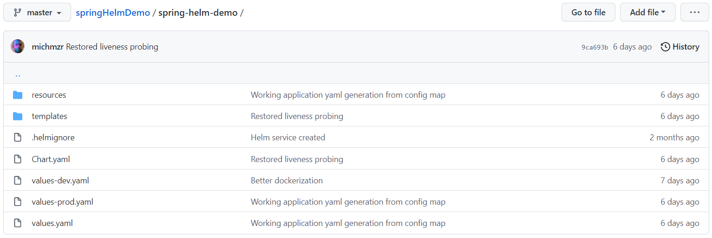
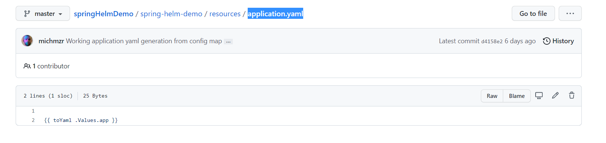
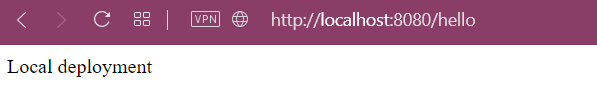
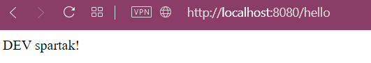

Hi,

The current post is aimed at developers, people who already have some experience with Spring, k8s and helm. I hope you will find the post useful. I was looking for something similar myself and didn't find it.

At the company, we work with microservices - mainly Spring Boot. We use [Kubernetes](https://github.com/kubernetes/kubernetes) and [Helm](https://helm.sh/) to configure our microservices. We have standard environments like
- dev
- stage/uat
- production

As it usually happens, the application must be configured differently depending on the environment, because it uses different resource IDs like queues, subscriptions, buckets.

We could use the built-in profile support in SpringBoot by using `application-[profile].yaml` files, but it is important for us and ops to see the current configuration and change something if needed, without the need for re-deployment which would force retesting, going through deployment and acceptance procedures. Change in properties doesn't require to rebuild and redeploy application. Some changes like logging level might be updated "on the fly".

Of course, we get similar functionality by using environment variables, but Helm helps generate and version the configuration of Kubernetes files and applications, which gives us much more capabilities.

For the purposes of the article I built a Spring Boot very simple hello world application with one REST endpoint which returns a message. You can find repo [on my github](https://github.com/michmzr/springHelmDemo).

## Configuration



This is my Helm config directory. It contains 3 separate values files - one general - `values.yaml`, `values-dev.yaml` for development and last one for production environment - `values-prod.yaml`

Local `application-local.yaml`  is very minimal and defines a hello world string. It only supports profile `local`.

``` yaml
config.hello: "Local deployment"
```

The content of the target application.yaml file is generated from the file template in the `.helm/spring-helm/templates/resources/application.yaml` directory.



Command `toYaml` copies whole `app` YAML section from values file. Thanks to which we only have one place where we have to define the configuration. Before I automated, all keys, so the entire application configuration structure had to be defined in this file and in values file. Of course, it caused a lot of problems ;)

File `values.yaml` contains general YAMl config for Kubernetes and Spring Boot app.
<https://github.com/michmzr/springHelmDemo/blob/master/spring-helm-demo/values.yaml>
It defines scaling, docker image, actuator endpoints etc.

``` yaml
replicaCount: 1

image:
  repository: michmzr/shd
  pullPolicy: Always
  # Overrides the image tag whose default is the chart appVersion.
  tag: latest

imagePullSecrets: []
nameOverride: ""
fullnameOverride: ""

serviceAccount:
  create: true
  annotations: {}

podAnnotations: {}

podSecurityContext: {}

securityContext: {}

service:
  type: LoadBalancer
  port: 8080

resources:
  requests:
    cpu: 100m
    memory: 128Mi
  limits:
   cpu: 200m
   memory: 512Mi

autoscaling:
  enabled: true
  minReplicas: 1
  maxReplicas: 1
  targetCPUUtilizationPercentage: 80

nodeSelector: {}

# APPLICATION PROPERTIES
app:
  spring:
    application:
      name: 'shd'

  management:
    health:
      livenessState.enabled: true
      readinessState.enabled: true
    endpoints:
      web:
        exposure:
          include:  health, mappings, configprops
    endpoint:
      configprops:
        enabled: true
      info:
        enabled: true
      health:
        probes:
          enabled: true
```

YAML files for dev and prod are much shorter.
For example `values-dev.yaml`

``` yaml
# SPRING PROPERTIES

env:
  - name: SPRING_PROFILES_ACTIVE
    value: dev

profile: dev

app:
  config:
    hello: "DEV spartak!"
```

## Deployment

I used the windows version of [Docker Desktop](https://www.docker.com/products/docker-desktop/) to set up a simple kubernetes cluster. Tool has built-in support for K8S, so you don't need to install minikube, create virtual machines to run cluster.

You will also need to install [Helm](https://helm.sh/) to generate and deploy application to cluster. It is also a simple matter.

To run app for the first time, you need to install Helm chart on cluster. You can do that with commands:

**Dev:**

``` bash
helm install spring-helm-demo spring-helm-demo  -f ./spring-helm-demo/values.yaml -f ./spring-helm-demo/values-dev.yaml
```

**Prod:**

``` bash
helm install spring-helm-demo spring-helm-demo  -f ./spring-helm-demo/values.yaml -f ./spring-helm-demo/values-prod.yaml
```

Each subsequent update can be done using the `helm upgrade` command instead of `helm install` for example:

``` bash
helm upgrade spring-helm-demo spring-helm-demo  -f ./spring-helm-demo/values.yaml -f ./spring-helm-demo/values-dev.yaml
```

## Demo build
I decided to use [com.spotify.dockerfile-maven-plugin](https://github.com/spotify/dockerfile-maven) to integrate Maven with Docker. This configures to build application image with mvn package and push it with `mvn deploy`. Of course you can also run `mvn dockerfile:build` explicitly.

If you run app with local, demo and prod config you will see:

**Local:**



**Dev:**



**Production:**


Feel free to experiment ;)

## Contact
I hope what I wrote is useful :). Please leave any comments to let me know. If you have any questions, please feel free to contact me directly on:
- Twitter: [https://twitter.com/MichalMzr](https://twitter.com/MichalMzr)
- LinkedIn: [https://www.linkedin.com/in/michmzr/](https://www.linkedin.com/in/michmzr/)

You can also find my posts on my second blog [Geekowojażer.pl](https://www.geekowojazer.pl/)
