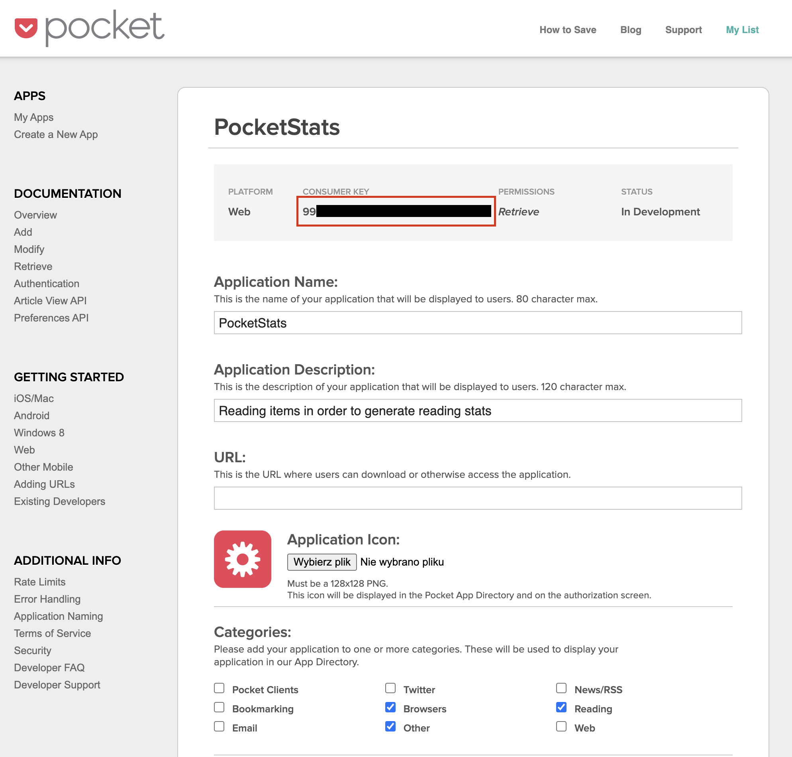
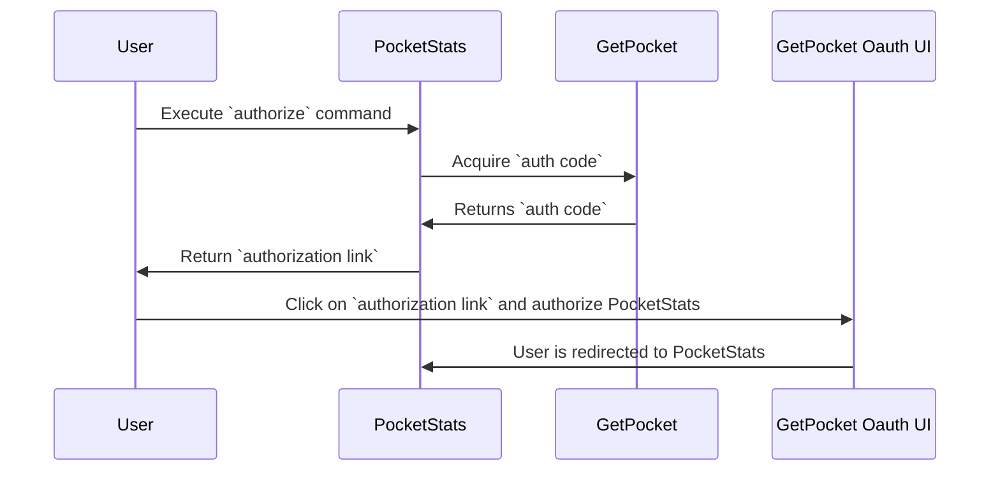

I am a person who likes to motivate myself through figures and compare my results with others. By the way I'm a geek, I spend most of my time on the Internet. I subscribe to a dozen newsletters, read the RSS feeds of dozens of blogs, browse social media like LinkedIn and Twitter regularly. Every day there are a lot of links to sites, documents, tools I want to familiarize myself with. I use a simple app for this - [GetPocket](https://getpocket.com/)
It supports android, ios, web, has plugins for browsers. It simply works. I click on "save to pocket" and the link is added to the "to read" list in the app. At my leisure, I browse the links, archive, mark the most interesting passages, save the links to "favorites". And so I have been using it for almost 11 years now. I really miss the ability to preview my statistics, e.g. how many links I have reviewed today, how many links I have since reviewed, how many I have added today, etc. etc.

Only 5% and 1% of the most active users get a nice annualy report. I feel out a year ago and I wasn't able to see how many I read, which tags are the most popular. I am not able to compare with friends. :/

The developers have released a REST API - https://getpocket.com/developer/docs/overview. I got together with about 2 years to write a simple application to generate statistics. I got together and in a dozen hours wrote a simple CLI Spring bot application with a database - MongoDB. Plus a simple Jupyter Notebook to generate charts and tables.

Why such a technology stack? I work with Java and spring boot on a daily basis, I know these tools, I know how to build an application quickly. The plan is to build a UI and make the application available for multi-user use. If you would be interested in using such an application, please give me a supportive comment ;) It is more pleasant to create something if I know it will be used.

You can find the application code on my github: https://github.com/michmzr/PocketStats

## Authorization and authentification with Pocket API
In order to use PocketAPI then I first had to create the application using https://getpocket.com/developer/apps/new. If you want to fire up the application locally, you will also have to do the same.

This is what the configuration looks like in my case:

I marked the red box `CONSUMER KEY` It will be needed when registering the user and getting the `access key`.

GetPocket Api uses Ouath2, so the application only stores the `access token` of the user. He just needs to log in through the PocketStats-generated authorization link, log in to GetPocket and allow PocketStats to connect.

Diagram of the authorization process.


`access token` i `auth code` are stored in a file in the application's current directory in the json form.
``` json
{"code":"...","accessCode":"..."}
```

## Technological Stack

I decided to use:
- Spring Boot v3
- Gradle
- Java min 17 version
- MongoDB - docker version `latest`.
- Docker - MacOs Arm version
- Spock 2 + groovy 3 for testing

I use `gradle` 7v to build project. I decided to use it, actually for learning. I have been using Maven on a daily basis for several years. I decided to do an experiment and see how Spring Boot 3 will work with the latest gradle. In Gradel I like the more readable source file, the way it works than in Maven.

Why MongoDB? I wanted to play with the technology, see how I like to work with this database. It's perfect for holding the Jsons it receives from the API. The bottleneck might be analytics and preparing individual statistics in the future.

Using docker and docker servicu file, you can create a ready-made MongoDB container on the latest version.
https://github.com/michmzr/PocketStats/blob/master/src/main/docker/mongodb.yml

## Application setup
You need to define an environment variable `POCKET_CONSUMER_KEY`, which stores the value of the `consumer key` returned by GetPOcket when creating a new Oauth application. For more on this process, see 


## Application interfaces
I decided to develop the app as a CLI application in the MVP version. This requires less work than creating a front end or designing endpoints under REST. I used [Spring Shell](https://spring.io/projects/spring-shell) to handle the commands. When you launch the application, a prompt appears in the console where you type commands.


Supported commands, their parameters, run conditions are defined using annotations. It works very cool :)

For example:

``` java
@ShellComponent
public class ImportPocketCommand extends SecuredCommand {
    private static final String EXPECTED_DATE_FORMAT = "dd-MM-yyyy";

    @Lazy
    private final ShellHelper shellHelper;

    private final PocketApiService pocketApiService;

    private final PocketItemRepository repository;

    public ImportPocketCommand(ShellHelper shellHelper, PocketApiService pocketApiService,
                               PocketItemRepository repository) {
        this.shellHelper = shellHelper;
        this.pocketApiService = pocketApiService;
        this.repository = repository;
    }

    @ShellMethod("Import items since last migration")
    @ShellMethodAvailability("isUserAuthorized")
    public void importFromLast() throws IOException, InterruptedException {
        shellHelper.print("Imported: " + pocketApiService.importFromSinceLastUpdate());
    }

    @ShellMethod("Import all items from API to DB")
    @ShellMethodAvailability("isUserAuthorized")
    public void importAll() throws IOException, InterruptedException {
        shellHelper.print("Imported: " + pocketApiService.importAll());
    }

    @ShellMethod("Import items since date to DB")
    @ShellMethodAvailability("isUserAuthorized")
    public void importSince(@ShellOption(value = {"-s", "--since"}, help = "Use date in DD-MM-YYYY format")
                            @CheckDateFormat(pattern = EXPECTED_DATE_FORMAT) String date) throws IOException, InterruptedException {
        DateTimeFormatter formatter = DateTimeFormatter.ofPattern(EXPECTED_DATE_FORMAT);
        LocalDateTime dateTime = LocalDate.parse(date, formatter).atTime(0, 0, 1);

        var sinceWhen = dateTime.withHour(0).withMinute(0).withSecond(1).atZone(ZoneId.systemDefault()).toInstant();

        shellHelper.print("Imported: " + pocketApiService.importAllToDbSince(sinceWhen));
    }

    @ShellMethod("Cleanup pocket items from database.")
    @ShellMethodAvailability("isUserAuthorized")
    public void cleanDb() {
        repository.deleteAll();

        shellHelper.printInfo("Collection of pocket items got cleaned.");
    }
}
```

The `@ShellMethodAvailability` annotation runs an AOP method that checks whether a command can be run by a user. For example, you can check if the user is logged in. My application requires that the user has previously authorized GetPocket and OAuth2 credentials have been retrieved.

``` java
public abstract class SecuredCommand {
    @Autowired
    PocketAuthorizationService authorizationService;

    public Availability isUserAuthorized() {
        if (authorizationService.getCredentials().isEmpty()) {
            return Availability.unavailable("you are authorized to GetPocket Api. Please use authorize command to be " + "able to " + "use " + "this command!");
        } else {
            return Availability.available();
        }
    }
}
```

Methods are annotated with `@ShellMethod` are run from the console. The method name is replaced with `kebab-case`. For example, the `importAll` method can be run with the `import-all` command.

```java
@ShellMethod("Import all items from API to DB")
    @ShellMethodAvailability("isUserAuthorized")
    public void importAll() throws IOException, InterruptedException {
        shellHelper.print("Imported: " + pocketApiService.importAll());
    }
```

## Items import from GetPocket
Statistics are calculated based on the contents of the database plugged into the application. If someone wants, he can rewrite the code, so that it calculates the statistics immediately after receiving the response, bypassing the database ;)

I decided to use a local database because of the speed of the solution, the ability to save the calculated statistics, information about users.

The heart of the integration is the `PocketApiService` class and the generic `callGetApi` method:

``` java
private PocketGetResponse callGetApi(Map%3CString, Object%3E extraFields) throws IOException, InterruptedException {
        Map<Object, Object> payloadData = new HashMap<>();
        payloadData.put("consumer_key", pocketConsumerKey);
        payloadData.put("access_token", getCreds().accessCode());
        payloadData.putAll(extraFields);

        String payload = mapper.writeValueAsString(payloadData);
        HttpRequest request = HttpRequest.newBuilder().POST(HttpRequest.BodyPublishers.ofString(payload)).uri(URI.create(pocketGetUrl)).header("Content-Type", "application/json").header("X-accept", "application/json").build();

        HttpResponse<String> response = client.send(request, HttpResponse.BodyHandlers.ofString());

        logResponse(response);

        switch (response.statusCode()) {
            case 200:
                return getPocketGetResponse(response);
            case 401:
                handle401(response);
                break;
            case 400:
            case 403:
            case 500:
            case 504:
                handleOtherHttpErrorCode(response);
            default:
                throw new IllegalStateException("Not expected http response code " + response.statusCode());
        }

        throw new IllegalStateException("Not expected http response code " + response.statusCode());
    }

    private PocketGetResponse getPocketGetResponse(HttpResponse<String> response) throws JsonProcessingException {
        return mapper.readValue(response.body(), PocketGetResponse.class);
    }

    private void handleOtherHttpErrorCode(HttpResponse<String> response) {
        log.error("Handling {} error", response.statusCode());
        ApiXHeaders apiXHeaders = ApiXHeaders.of(response);

        throw new IllegalStateException(String.format("Http request failed with status: %s." + "Api pocket responded with 401, " + "error code: %d, " + "error description: %s", apiXHeaders.status(), apiXHeaders.errorCode(), apiXHeaders.error()));
    }

    private void handle401(HttpResponse<String> response) {
        log.info("Handling 401 error");
        ApiXHeaders apiXHeaders = ApiXHeaders.of(response);

        throw new IllegalStateException("Generate new token!. Authorization failed with status: '%%s'. Api pocket responded with 401, error code: %%d, %s".formatted("error description: %s".formatted(apiXHeaders.status(), apiXHeaders.errorCode(), apiXHeaders.error())));
    }

    private void logResponse(HttpResponse<String> response) {
        log.debug("status: {}", response.statusCode());

        // print response body
        if (response.statusCode() != HttpStatus.OK.value()) {
            log.debug("response: {}", response.body());

            ApiXHeaders apiXHeaders = ApiXHeaders.of(response);
            log.debug("api X headers: {}", apiXHeaders);
        }
    }

    public PocketUserCredentials getCreds() {
        return authorizationService.getCredentials().orElseThrow(() -> new IllegalStateException("Not found saved credentials. Authorize to service first"));
    }
```

The `callGetApi` function is responsible for executing the request and processing the response from the server.

The imported link history from GetPocket is kept in the MongoDB database as a `pocketItem` document.

## REST/web endpoints
The application publishes only one http endpoint - `pocket/auth`. It is needed to confirm the completion of the authorization flow.

```java
@Slf4j
@RestController
@RequestMapping("/pocket/auth/")
public class PocketApiController {
    @Autowired
    private PocketAuthorizationService authorizationService;

    @GetMapping("token")
    public String onRedirect() {
        log.info("Redirection successful.");

        authorizationService.deregisterAuthSession();

        return "authorized app. You can go back to console.";
    }
}
```

## Raport
I have prepared a simple jupiter notebook https://github.com/michmzr/PocketStats/blob/master/src/main/raporting/raport.ipynb, where using Pandas loads data from the database and generates charts or tables.

In the next version of PocketStats I would already like to have a simple visual dashboard.


## Contact
I hope what I wrote is useful :). Please leave any comments to let me know. If you have any questions, please feel free to contact me directly on:
- Twitter: [https://twitter.com/MichalMzr](https://twitter.com/MichalMzr)
- LinkedIn: [https://www.linkedin.com/in/michmzr/](https://www.linkedin.com/in/michmzr/)

You can also find my posts on my second blog [Geekowojażer.pl](https://www.geekowojazer.pl/)
