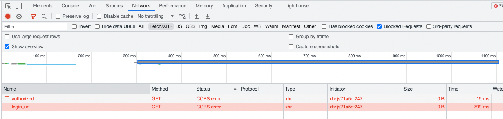

>Cross-origin resource sharing (CORS) is a mechanism that allows restricted resources on a web page to be
  requested from another domain outside the domain from which the first resource was served. https://en.wikipedia.org/wiki/Cross-origin_resource_sharing

Here are 5 examples when CORS mechanism should be used:
- When a web application needs to make AJAX requests to a different domain to fetch data or resources, such as images or scripts.
- When a web application is hosted on a different domain than the API or server it needs to access. This can be the case for microservices architectures, where each service may be hosted on a different domain.
- When a web application needs to access third-party APIs, such as social media APIs, payment gateways, or weather services.
- When a web application needs to embed content from another website, such as an iframe or image.
- When a web application needs to serve resources from a CDN (Content Delivery Network) or other third-party hosting service.

In summary, It is a security mechanism implemented in web browsers to prevent web pages from making requests to a different domain than the one that served the original content.
It is typically used to protect against cross-site scripting (XSS) attacks and other malicious web-based attacks.


## How to recognise blocked request by CORS policy
Most browsers enforce Cross Origin by default unlike many development tools like Postman.

Its example of blocked request in Brave's developers console (chromium engine):


Console also prints error like:
```
Access to XMLHttpRequest at 'http://localhost:8080/pocket/auth/login_url' from origin 'http://localhost:8081' has been blocked by CORS policy: No 'Access-Control-Allow-Origin' header is present on the requested resource.
```

The following examples in addition to the domain, methods, also define the duration of prefight request.

A preflight request is an HTTP request that is sent by the browser to check if a CORS-enabled resource can be accessed from a different domain. The preflight request is sent automatically by the browser before making the actual request to the server, and it includes HTTP headers that describe the intended request.
The preflight request is an HTTP OPTIONS request that includes the following headers:

**Access-Control-Request-Method:** The HTTP method of the intended request, such as GET, POST, or PUT.<br/>
**Access-Control-Request-Headers**: A list of HTTP headers that will be included in the intended request, such as `Authorization`, `Content-Type`, or `X-Custom-Header`.

## Configuration examples with annotations
Developer can use `@CrossOrigin` annotation on controller or request method.

### 1. Enabling CORS for all origins
This configuration enables CORS for all origins, allowing all HTTP methods, headers, and credentials.

```java
import org.springframework.web.bind.annotation.CrossOrigin;
import org.springframework.web.bind.annotation.RestController;

@RestController
@CrossOrigin(origins = "*", maxAge = 3600)
public class MyRestController {
  // REST controller methods here
}
```

### 2. Enabling CORS for a specific origin
This configuration enables CORS for a specific origin (https://example.com), allowing all HTTP methods, headers, and credentials

```java
@RestController
@CrossOrigin(origins = "https://example.com", maxAge = 3600)
public class MyRestController {
  // REST controller methods here
}
```

### 3. Enabling CORS for multiple origins
This configuration enables CORS for multiple origins (https://example.com and https://example.org), allowing all HTTP methods, headers, and credentials.

```java
@RestController
@CrossOrigin(origins = {"https://example.com", "https://example.org"}, maxAge = 3600)
public class MyRestController {
  // REST controller methods here
}
```

#### 4. Enabling CORS for specific HTTP methods
This configuration enables CORS for all origins, allowing only HTTP GET and POST methods.

```java
@RestController
@CrossOrigin(origins = "*", methods = {RequestMethod.GET, RequestMethod.POST}, maxAge = 3600)
public class MyRestController {
  // REST controller methods here
}
```

or

```java
import org.springframework.web.bind.annotation.CrossOrigin;
import org.springframework.web.bind.annotation.GetMapping;
import org.springframework.web.bind.annotation.RequestMapping;
import org.springframework.web.bind.annotation.RestController;

@RestController
public class MyRestController {
  @CrossOrigin
  @RequestMapping(method = RequestMethod.GET, path = "/{id}")
  public Account retrieve(@PathVariable Long id) {
    // ...
  }

  @CrossOrigin
  @RequestMapping(method = RequestMethod.POST, path = "/{id}")
  public UserAccount retrieve(@PathVariable Long id) {
    // ...
  }
}
```

#### 5. Enabling CORS for specific HTTP headers
This configuration enables CORS for all origins, allowing only the `Authorization` and `Content-Type` headers.

```java
@RestController
@CrossOrigin(origins = "*", allowedHeaders = {"Authorization", "Content-Type"}, maxAge = 3600)
public class MyRestController {
  // REST controller methods here
}
```

or

```java
@RestController
public class MyRestController {
  @CrossOrigin(origins = "*", allowedHeaders = {"Authorization", "Content-Type"}, maxAge = 3600)
  public Account retrieve(@PathVariable Long id) {
    // ...
  }
}
```

## Configuration examples with Global CORS
Spring lets us a global CORS configuration for our controllers. It can be declared within Spring MVC and combined with a fine-grained @CrossOrigin configuration.

### 1. Enabling CORS for all origins
This configuration enables CORS for all origins, allowing all HTTP methods, headers, and credentials. It also sets a maximum age of 3600 seconds (1 hour) for preflight requests.

```java
import org.springframework.context.annotation.Bean;
import org.springframework.context.annotation.Configuration;
import org.springframework.web.servlet.config.annotation.CorsRegistry;
import org.springframework.web.servlet.config.annotation.WebMvcConfigurer;

@Configuration
@EnableWebMvc
public class WebConfig implements WebMvcConfigurer {

  @Override
  public void addCorsMappings(CorsRegistry registry) {
    registry.addMapping("/**")
      .allowedOrigins("*")
      .allowedMethods("*")
      .allowedHeaders("*")
      .allowCredentials(true)
      .maxAge(3600);
  }
}
```

### 2. Enabling CORS for a specific origin
This configuration enables CORS for a specific origin (https://example.com), allowing all HTTP methods, headers, and credentials.

```java
@Configuration
@EnableWebMvc
public class WebConfig implements WebMvcConfigurer {

  @Override
  public void addCorsMappings(CorsRegistry registry) {
    registry.addMapping("/**")
        .allowedOrigins("https://example.com")
        .allowedMethods("*")
        .allowedHeaders("*")
        .allowCredentials(true)
        .maxAge(3600);
  }
}
```

### 3. Enabling CORS for multiple origins
This configuration enables CORS for multiple origins (https://example.com and https://example.org), allowing all HTTP methods, headers, and credentials.

```java
@Configuration
@EnableWebMvc
public class WebConfig implements WebMvcConfigurer {

  @Override
  public void addCorsMappings(CorsRegistry registry) {
    registry.addMapping("/**")
        .allowedOrigins("https://example.com", "https://example.org")
        .allowedMethods("*")
        .allowedHeaders("*")
        .allowCredentials(true)
        .maxAge(3600);
  }
}
```

### 4. Enabling CORS for specific HTTP methods:
This configuration enables CORS for all origins, allowing only HTTP GET and POST methods.

```java

@Configuration
public class CorsConfiguration implements WebMvcConfigurer {

  @Override
  public void addCorsMappings(CorsRegistry registry) {
    registry.addMapping("/**")
            .allowedOrigins("*")
            .allowedMethods("GET", "POST")
            .allowedHeaders("*")
            .allowCredentials(true)
            .maxAge(3600);
  }
}
```

### 5. Enabling CORS for specific HTTP headers:
This configuration enables CORS for all origins, allowing only the `Authorization` and `Content-Type` headers.

```java
@Configuration
public class CorsConfiguration implements WebMvcConfigurer {

  @Override
  public void addCorsMappings(CorsRegistry registry) {
    registry.addMapping("/**")
            .allowedOrigins("*")
            .allowedMethods("*")
            .allowedHeaders("Authorization", "Content-Type")
            .allowCredentials(true)
            .maxAge(3600);
  }
}

```
## Contact
My hope is that my writing is useful to you :). Please leave any comments to let me know. If you have any questions, please feel free to contact me directly on:
- Twitter: [https://twitter.com/MichalMzr](https://twitter.com/MichalMzr)
- LinkedIn: [https://www.linkedin.com/in/michmzr/](https://www.linkedin.com/in/michmzr/)

You can also find my posts on my second blog [Geekowojażer.pl](https://www.geekowojazer.pl/)
