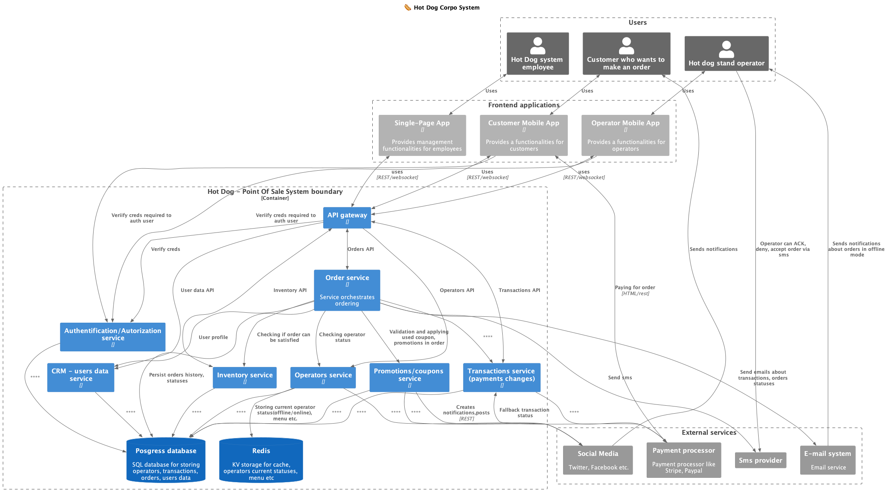

Hello ✋,

I'm starting a new challenge on the blog. I'm reading a great book ["System design interview"](https://www.amazon.com/System-Design-Interview-insiders-Second/dp/B08CMF2CQF) and I came up with the idea for a series of posts dedicated to system design. A necessary skill for seniors, especially those applying for more important decisions.

I found an interesting page https://www.architecturalkatas.com/kata.html, where you can draw a system that we will design.

I drew:

```
Hot Diggety Dog!

Local hot dog stand merchant wants a point-of-sale system for his hot dog stand operators

Requirements: must be lightweight in size--laptop is too unwieldy to use efficiently when making hot dogs on the street; allow for discounts; track sales by time and location; send inventory updates to mobile inventory-management staff (who drive to the location with supplies); provide a social-media integration so customers can be notified when a hot dog stand is nearby

Users: fifty or so hot dog stand operators, thousands of customers in the local area (via social-media)
```

I decided to use Chat-GPT to be my client, who by asking about business requirements will design the details of the system.

I used the following prompt to support the design process:
```
You are to assume the role of a system design interviewer for a prominent IT company, assessing a candidate's expertise for the role of system architect. Maintain a friendly demeanor while being thorough and detail-oriented. Aim for succinct answers and focus on critical system aspects to gauge the candidate's system design proficiency. Correct any factual or logical errors in the candidate's questions or answers, providing realistic figures when required. Engage in active conversation, asking for specific details and adopting the candidate's language. Answer in user language

Scenario: A local hot dog stand merchant needs a point-of-sale system for their operators.

Requirements:
1. Lightweight and portable, as laptops are too unwieldy for street use
2. Allows for discounts
3. Tracks sales by time and location
4. Sends inventory updates to mobile inventory-management staff
5. Integrates with social media to notify customers of nearby hot dog stands

Users: Around 50 hot dog stand operators and thousands of local customers (via social media)

Your goal is to test the user's system design knowledge and skills.
```
**Temperature:** `0.2`
**Model:** `GPT-4`

## Questions

**What payment systems should the application support?**

```
The application should process both card and cash payments.
```

**What discount management features should the system include? Does this include rules for individual customers, specials, discount codes? Can the point add its own promotions?**

```
Yes, the system should allow for managing different types of discounts. Here are some features that might be useful:

1. Ability to create discount codes that customers can enter during payment.
2. Ability to set time-based discounts, for example, on certain days of the week or hours.
3. Ability to set discounts on specific products.
4. Ability to set discount rules for individual customers, for example, based on the frequency of their purchases.

Yes, point of sale operators should be able to add their own promotions.

```

**How can a user place an order online?**

```
Online orders can be made through a dedicated mobile app. The user should be able to browse the menu, choose products, add them to the cart, enter discount codes, and make payments. After placing an order, the user should receive an order confirmation and an estimated waiting time.
```

**How many customers and orders can we expect in a day? How many orders can there be in peak hours?**

```
The number of customers and orders can vary significantly depending on the location, day of the week, and time of day. For a small local business, such as a hot dog stand, we can assume that they can serve about 100-200 customers per day on average.

During peak hours, for example at lunchtime or during local events, this number can increase to 30 orders per hour from a single point.
```

**Should the operator be constantly connected to the internet?**

```
Ideally, the operator should always have access to the Internet - this would allow for real-time data transmission, conveying information about sales and inventory status, thus contributing to efficient process management. However, such a solution is not always possible, especially if the operator works in places with poor network coverage.

Therefore, it would be beneficial if the system could also operate offline, and as soon as an Internet connection is available, it would automatically synchronize, sending the data stored on the device.
```

**When should sales and inventory reports be generated? What are the analytical needs? Do we need to process them in real time or is it enough to perform a batch at a certain time?**

```
This is an excellent question. Depending on business needs, reports can be generated and processed in real time or at specific intervals.

For daily operations, such as tracking sales and inventory status, batch processing every few hours or at the end of the day would probably suffice. This would allow for ongoing monitoring of the situation and decision-making based on the latest data.

On the other hand, for more strategic decisions, such as order planning or sales trend analysis, we might need reports generated in real time. This would allow us to quickly respond to market changes and optimize our operations.
```

**What exactly should we track and record about sales in real time in terms of time and location?**

```
The system should track and record the following data:

1. Sales time: The exact date and time when the transaction was made. This will allow for the analysis of sales patterns and identification of peak sales periods.

2. Sales location: The exact location where the transaction was made. This will allow for the identification of the most profitable locations.

3. Transaction details: What products were sold, their quantity, the price of each product, whether any discounts were applied, etc.

This data should be available in real time for point-of-sale operators and management staff.
```

**Is there a preferred inventory management system for integration with the POS system?**

```
Yes, the point should have access to the inventory management system.
```

**How would point operators use the inventory management system?**

```
Operators could scan product barcodes using the built-in camera on their device to update inventory quantities after each sale. The system should also send notifications to operators when the inventory level reaches a critical point so they can place orders in time.

We could also integrate the system with a similar POS system to automatically update inventory based on sales.
```

**What if the operator didn't have time to update the inventory status and immediately proceeded with order fulfillment? Operators usually work under difficult conditions, they have to improvise.**

```
This is an important point to consider. In an ideal scenario, the POS system would be designed to automatically update the inventory status after each sales transaction. This would minimize the need for the operator to manually update the inventory status. However, I understand that in reality there may be situations that prevent direct and automatic updates.

In such a case, the system should be designed to allow operators to manually update inventory status at any time. It should be accessible on mobile devices, so that operators can easily update stock levels whenever they find the time. Additionally, we should anticipate a notification system that would remind operators of the need to update inventory status if the system notices that there has been no update for a certain period of time, especially if orders were being fulfilled despite shortages in inventory.

Features such as low stock level notifications, product demand forecasts, and order recommendations can also help operators manage inventory effectively despite challenging working conditions.

It is important that the system is intuitive and easy to use, even for people who do not have much experience with technology. Operators should also be trained in how to use the system so that they can make the most of its features.
```

**What are the expectations regarding system availability? Does the system need to be available 24/7, or are downtime periods for maintenance, etc., acceptable?**

```
For a point of sale system, like the one we are discussing, high availability is expected. Hot dog stands may operate at different hours, and some may even operate 24/7. Therefore, it is important that the system is available whenever operators need it.
```

**Does the system need to be real time? What is the tolerance for delay when placing an order?**

```
Yes, the point of sale system should be able to process transactions in near real time. When a customer places an order, they expect immediate confirmation that the order has been accepted and is being processed.

As for tolerance for delays, ideally, the system's response time should be as short as possible, usually below a few seconds. Longer delays can lead to customer frustration and can affect the performance of the stand operators.
```

**Is there a specific platform - smartphone, website, POS terminal for stand operators?**
```
For hot dog stand operators, the most practical solution would be to use a mobile application on smartphones or tablets. This way, operators could easily conduct transactions, track sales, and manage inventory directly from their stand.
```
**Are there any security or privacy requirements in mind, for example, in relation to storing customer and transaction data?**

```
Yes, security and privacy are key aspects in any system that stores customer and transaction data. The system should comply with privacy regulations, such as GDPR in Europe.

In relation to transaction data, the system should comply with PCI DSS (Payment Card Industry Data Security Standard), which is a security standard for organizations that handle card payments.

Some of the requirements include:

1. Data encryption: All data, including personal data and transaction data, should be encrypted during transmission and storage.
2. Authorization and authentication: Only authorized individuals should have access to system data.
3. Regular security audits: The system should be regularly checked for potential security gaps.

**How often and when should the user receive notifications so that they are not annoying?**

This is a very important question. Too frequent notifications can be annoying for users and lead to them starting to ignore notifications or even stop following the stand on social media.

One approach could be to send notifications only when the user is within a certain radius of the stand and only during the hours when the stand is open. Users could also be given the option to customize notification settings, for example, allowing them to choose how often they want to receive notifications.

Additionally, it's worth remembering that not all notifications have to be location-related. For example, you can send notifications about special promotions, new products, etc.
```

**What kind of notifications about nearby points do users receive? Push notifications from the app, a message from a chatbot, push notifications from FB & Twitter apps, a post on FB & Twitter newsfeed?**

```
For this particular scenario, push notifications from the app may prove to be the most effective. These notifications can be sent directly to users' smartphones when they are near a hot dog stand. These notifications can contain information about the location of the stand, available products, special promotions, etc. When designing and implementing this geolocation-based functionality, GDPR/RODO compliance should be kept in mind.

Additionally, customers can subscribe to our social media to receive geo-fence notifications about the nearest points or updates on location changes of the points.
```

**When does the customer pay for the order?**

```
The customer always pays in advance when placing the order. For orders placed through the app, they pay using a payment gateway.
```

## Project Requirements

### 🤖🔧 Functional

- the point operator's application must work in both online and offline mode
- payments are made in cash, by credit card, or through a gateway
- the user can receive notifications about location changes of operators in a specific region e.g. district, city.
- the operator should be able to update the inventory status by manually adding products.
- the operator must accept the order upon receipt. They also receive information about the current inventory status and whether they can fulfill it.
- the user can view the nearest operator points in the app.
- both the company and the operator can define a wide range of promotions such as combined products e.g. hot-dog + cola - 20% cheaper, discounts, promotional codes.

### 📈 Non-functional

- We will not store customers' credit card data. We will use payment terminals and payment processors like Stripe/PayU/PayPal
- scalability - the system should adapt to the changing number of orders throughout the day
- low latency - the customer expects quick confirmation and execution of the order
- persistence - every change in order status should be recorded in the database, especially important in the case of payments.
- reliability - the system should be available and reliable. The operator should be able to use the system, even if they do not have internet access.
- secure - customer, operator, and transaction data must be protected, the system should comply with GDPR/RODO standards.

## 🧮 Back of the envelope estimations

- 50 service points
- an average of 100 customers from each point, which comes out to 5000 transactions per day (3.5 transactions per minute).
- During peak hours we have about `50*40=2000` orders per hour (0.5 transactions per second).

According to the calculations, we are dealing with a small system. I would design it in a modular monolith architecture to reduce production and maintenance costs. If the business scaled up significantly, to hundreds of transactions per second, microservices could be separated for key modules of the critical path.

## 🏗️ Proposed architecture

**System components**:
- **API gateway:** - it is a window to the backend world, intermediates in connections between mobile/web applications and the rest of the system. It performs several functions: connection authentication, provides connection metrics, aggregates APIs from all system services.
- **Inventory** - responsible for storing and updating the inventory status of data points. Operators update the inventory status using requests.
- **Notifications system** - based on the entered locations of current and future operators, geolocation notifications for customers are sent via social media, entries are added to social media with updated locations e.g. "today in AK park from 9 am a HotDog is waiting for you. Only today from 11:15 to 13 a 30% discount on the set with the code 'AK_HOT' when purchasing through the application"
- **CRM** - manages user data: registration, change of personal data,
- **Transactions** - updates the transaction status based on online payments, card or cash. The transaction must be completed correctly for the order to be directed to the chef for preparation.
- **Orders** - orchestrates the order, checks the inventory status whether the order can be executed. The order placed through the mobile application must be accepted by the operator.
- **Operators** - manages current operator data e.g. location, opening hours, menu.

**External integrations:**
- **Social media** - social media platforms like FB, X
- **Payment processor:** - payment processing system like Paypal, PayU, GooglePay. It's a generic name for a few integrations. One processor should be used to handle many cashless payment methods.
- **SMS provider:** - SMS provider, a system that can send short messages to operators and customers. It should be able to receive SMS-es from providers and forward their answers to the backend. It's an important part of offline mode.
- **Email provider:** - an external system for sending emails to operators and customers. It can be used for transactional and marketing emails. I decided to make it an external integration to ensure reliable email deliverability.

## Connecting the operator and customer applications with the backend
For communication of the operator and customer applications with the backend, I would use WebSockets. Information about new orders, changes in order statuses or operations would be handled in this way. This would give a great benefit in the form of information about the current state of the mobile connection at the seller.

Part of the client application queries may look like this:
```
The client has placed an order. Sends one request per second to check if the order is ready.
0 second: Is the food ready? (Client)
0 second: No, please wait. (Server)
1st second: Is the food ready? (Client)
1st second: No, please wait. (Server)
2nd second: Is the food ready? (Client)
2nd second: No, please wait. (Server)
3th second: Is the food ready? (Client)
3th second: Yes, here is your order. (Server)
```

For communication, you can also use HTTP pooling or HTTP long pooling, but this is a more resource-demanding solution e.g. websockets.

If the operator is online (heartbeat positive in the last few minutes) and has auto-confirmation enabled plus the inventory status is consistent (according to the inventory and the update was within e.g. 1h), the order is automatically confirmed.

If a customer has placed an order for e.g. a hot dog in a gluten-free bun and there is no such bun in stock, they should be offered a hot dog in a different bun. The system should use alternative products to ensure sales instead of abandoning the customer.

### Offline mode

Offline mode is a very important functionality from the point of view of operators and customers. The operator should be able to continue operations in case of loss of stable internet access. In the meantime, he can make sales, handle orders from the application.

The backend should be "aware" of the connection status with the operator's mobile application. This can be achieved by using a constant websocket channel with the mobile application. During the connection with the server, the channel is maintained by the application. The last connection status (timestamp, connection data, whether it's LTE, GPRS, transfer speed) can be stored in the Redis database. If the last connection was, for example, 5 minutes ago, the operator is marked as offline and sales through client applications must operate differently.

#### Operator's Offline Mode
When designing the application, we assume that it must work in offline mode. The operator should be able to continue operations in case of loss of stable internet access. In the meantime, they can make sales, handle orders from the application. To achieve this, we need to save in memory the history of events such as new orders, goods deliveries, payments, etc. If the operator is offline, the application should save events in the device's memory. When the operator returns to the network range, the application should synchronize events with the server. There are various approaches to designing offline mode. One of them is using a database for offline mode e.g. Firebase/Realm, PouchDB, which would automatically synchronize differences after regaining a stable connection. I decided not to recommend this solution due to the coupling of the mobile application with the database schema. Any change in the database e.g. adding new fields in the order table would require updating all user applications, which can take weeks. We lose agility and speed in delivering new features. I decided on a solution where the mobile application has something like an event store, to which events are saved. These events then need to be synchronized with the backend.

#### Offline Order Flow
My proposal for handling orders through the client application when the operator is offline, assuming that they are within the range of the telephone network and can receive/send SMS messages.

The customer orders online, if there was no recent connection via websocket with the operator, it sends them an SMS with a request for confirmation by sending a return SMS plus a QR code with order data (user id, order id, transaction id, order json) necessarily heavily compressed.

1. The customer places an order through the application/web.
2. The order service checks whether the operator is online/offline, using the saved connection status in Redis.
3. An SMS/MMS is sent to the operator with information about the order, e.g. order id, what is included in the order, who ordered, etc. The application, using permissions, can parse such an SMS and update the status in the application.
4. The operator can call/send an SMS with confirmation/rejection of the order.
5. Thanks to the use of the SMS provider's API, the backend receives the operator's response.
6. The customer receives confirmation/rejection of the order. If the time for the seller's response has passed, the customer should be informed about it. Additionally, the customer will not have up-to-date information about the order, so they may receive a message that they simply have to go to the sales point now if it can be realized.
7. The customer shows the QR code of the order. It is read by the reader and is validated in the seller's application.

## C4 Container system diagram
You can find example C4 diagram of Hot Dog System below.


## Wrap-up
I think I touched on the system design quite superficially. It could be further expanded with additional levels of the C4 diagram, or attempt event storming to separate business domains. In case the system was to be developed, it would be worth doing so.

I hope the article at least intrigued you, you learned something new. If you have any comments, let me know in the comment. If you want me to write about a specific topic, also let me know. Until next time!


## Contact
I hope what I wrote is useful :). Please leave any comments to let me know. If you have any questions, please feel free to contact me directly on:
- Twitter: [https://twitter.com/MichalMzr](https://twitter.com/MichalMzr)
- LinkedIn: [https://www.linkedin.com/in/michmzr/](https://www.linkedin.com/in/michmzr/)

You can also find my posts on my second blog [Geekowojażer.pl](https://www.geekowojazer.pl/)

