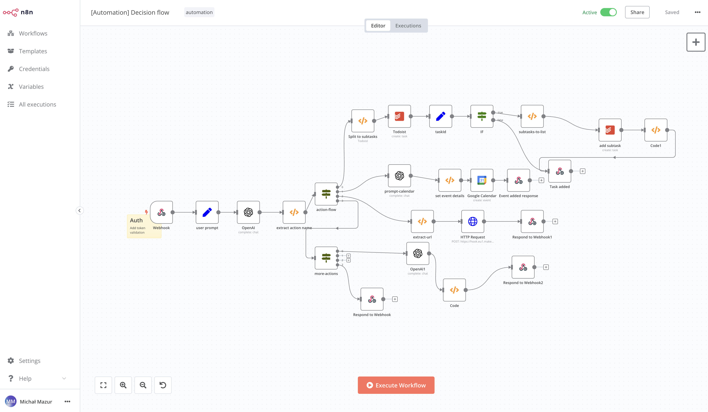

Hello ✋,

A few months ago, I came across an interesting tool for process automation. In its functionalities, it is very similar to Zapier, IFTT, or make.com. It's called [N8N](https://n8n.io/).

I base my automations, such as an "AI" assistant or managing Todoist, which I use for task and project management, on n8n. Some processes are still kept on [make.com](https://www.make.com/en). What sets it apart from make.com is its free self-hosted version. It means that if you have your server, you can install and use it for free. Make can become very costly after exceeding a certain number of operations per month, and there is also a privacy aspect because the data is kept by them.

In the article, I'm going to show how to use docker compose to set up the application for yourself. It will require basic skills in Linux administration and Docker. You can also use any other platform where Docker images will work or a virtual machine.

**Screenshot one of my automations**



## 1. Install docker
Follow below links:
**Ubuntu:** https://docs.docker.com/engine/install/ubuntu/
**Debian:** https://docs.docker.com/engine/install/debian/
**other platforms:** https://docs.docker.com/engine/install/

## 2. Create docker-compose.yml file
Create docker-compose.yml file in one of directories.
I file in my case is located in `/var/lib/n8n/docker-compose.yml`

```yaml
version: '3.1'

services:
  n8n:
    image: docker.n8n.io/n8nio/n8n
    restart: unless-stopped
    container_name: n8n
    ports:
      - "5678:5678"
    environment:
      - N8N_BASIC_AUTH_ACTIVE=true
      - N8N_BASIC_AUTH_USER=foo-user
      - N8N_BASIC_AUTH_PASSWORD=very-long-password
      - N8N_HOST=[host IP or domain]
      - N8N_PORT=5678
      - WEBHOOK_URL=[your webhook url]
    volumes:
      - /var/run/docker.sock:/var/run/docker.sock
      - ./n8n:/home/node/.n8n
```

**where**:
`foo-user` - is your username <br/>
`very-long-password` - is your password<br/>
`[host IP or domain]` - is your server IP i.e `127.0.0.1` or domain <br/>
`[your webhook url]` - is your webhook url i.e https://n8n.domain.com <br/>

## 3. Configure reverse proxy (nginx)
N8n config file path: `/etc/nginx/sites-available/n8n.conf`

```nginx
server {
    server_name [server name];
    location / {
        proxy_pass [server ip with port 5678];
        proxy_http_version 1.1;

        # WebSocket support
        proxy_set_header Upgrade $http_upgrade;
        proxy_set_header Connection "upgrade";
        proxy_read_timeout 86400; # This can be set higher, necessary for WebSocket

        proxy_set_header Host $host;
        proxy_set_header X-Real-IP $remote_addr;
        proxy_set_header X-Forwarded-For $proxy_add_x_forwarded_for;
        proxy_set_header X-Forwarded-Proto $scheme;

        # Other settings
        chunked_transfer_encoding off;
        proxy_buffering off;
        proxy_cache off;
    }


    listen 443 ssl; # managed by Certbot
    ssl_certificate /etc/letsencrypt/live/n8n.cybershu.eu/fullchain.pem; # managed by Certbot
    ssl_certificate_key /etc/letsencrypt/live/n8n.cybershu.eu/privkey.pem; # managed by Certbot
    include /etc/letsencrypt/options-ssl-nginx.conf; # managed by Certbot
    ssl_dhparam /etc/letsencrypt/ssl-dhparams.pem; # managed by Certbot

}server {
    if ($host = n8n.cybershu.eu) {
        return 301 https://$host$request_uri;
    } # managed by Certbot
```

I use certbot to generate and manage ssl certificates. You can find more information here: https://certbot.eff.org/instructions

## Run docker-compose
```bash
docker-compose up -d
```

## Enable n8n proxy service
```bash
cd sites-enabled
sudo ln -s ../sites-available/n8n.conf .
ls -l
```

and restart nginx
```bash
sudo systemctl restart nginx
```

## Login to your n8n instance
Go to https://n8n.domain.com and login with your credentials.

## Useful links
- [https://docs.n8n.io/hosting/](https://docs.n8n.io/hosting/)
- [https://www.cyberciti.biz/faq/nginx-restart-ubuntu-linux-command/](https://www.cyberciti.biz/faq/nginx-restart-ubuntu-linux-command/)
- [https://community.n8n.io/t/websockets-and-sse-connection-lost/27137/6](https://community.n8n.io/t/websockets-and-sse-connection-lost/27137/6)

## Wrap-up
I hope the article at least intrigued you, you learned something new. I

## Contact
Please leave any comments to let me know. If you have any questions, please feel free to contact me directly on:
- Twitter: [https://twitter.com/MichalMzr](https://twitter.com/MichalMzr)
- LinkedIn: [https://www.linkedin.com/in/michmzr/](https://www.linkedin.com/in/michmzr/)

You can also find my posts on my second blog [Geekowojażer.pl](https://www.geekowojazer.pl/)
