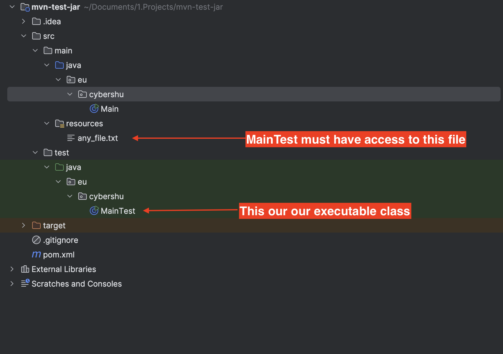

Hello there ✋,

Hello ✋, I was tasked with integrating a Java class for data generation into our
CI/CD pipeline. The goal was to create a shaded JAR that could run directly from
the pipeline.

The challenge was that the class was in the tests directory, which Maven doesn't
support for building JARs. I resolved this by using the maven-shade-plugin and
maven-resources-plugin to build a shaded JAR, including necessary resources like
SQL schema files.



I hope this example saves you time during development! 🚀

## Code

### Maven

This Maven configuration uses two key plugins to build and run a JAR file with
an executable Java class (MainTest) in the tests directory: the Maven Shade
Plugin and the Maven Resources Plugin.

```xml
<?xml version="1.0" encoding="UTF-8"?>
<project xmlns="http://maven.apache.org/POM/4.0.0"
         xmlns:xsi="http://www.w3.org/2001/XMLSchema-instance"
         xsi:schemaLocation="http://maven.apache.org/POM/4.0.0 http://maven.apache.org/xsd/maven-4.0.0.xsd">
  <modelVersion>4.0.0</modelVersion>

  <groupId>eu.cybershu</groupId>
  <artifactId>mvn-test-jar</artifactId>
  <version>1.0-SNAPSHOT</version>

  <properties>
    <maven.compiler.source>17</maven.compiler.source>
    <maven.compiler.target>17</maven.compiler.target>
    <project.build.sourceEncoding>UTF-8</project.build.sourceEncoding>
  </properties>

  <profiles>
    <profile>
      <id>test-jar</id>
      <build>
        <plugins>
          <plugin>
            <groupId>org.apache.maven.plugins</groupId>
            <artifactId>maven-shade-plugin</artifactId>
            <version>3.6.0</version>
            <executions>
              <execution>
                <goals>
                  <goal>shade</goal>
                </goals>
                <configuration>
                  <shadedArtifactAttached>true</shadedArtifactAttached>
                  <transformers>
                    <transformer implementation=
                                   "org.apache.maven.plugins.shade.resource.ManifestResourceTransformer">
                      <mainClass>eu.cybershu.MainTest</mainClass>
                    </transformer>
                  </transformers>
                </configuration>
              </execution>
            </executions>
          </plugin>

          <plugin>
            <groupId>org.apache.maven.plugins</groupId>
            <artifactId>maven-resources-plugin</artifactId>
            <version>3.3.1</version>
            <executions>
              <execution>
                <id>copy-test-classes</id>
                <phase>process-test-classes</phase>
                <goals>
                  <goal>copy-resources</goal>
                </goals>
                <configuration>
                  <outputDirectory>${project.build.outputDirectory}
                  </outputDirectory>
                  <resources>
                    <resource>
                      <directory>${project.build.testOutputDirectory}
                      </directory>
                      <includes>
                        <include>**/*.class</include>
                      </includes>
                    </resource>
                  </resources>
                </configuration>
              </execution>
            </executions>
          </plugin>
        </plugins>
      </build>
    </profile>
  </profiles>
</project>
```

#### Maven Shade Plugin

The Maven Shade Plugin is used to package the project into an executable JAR
file. This plugin performs several tasks, such as combining dependencies into a
single JAR and modifying the manifest file to specify the main class.

Shading phase packs the project into a JAR file that includes dependencies.

**Configuration:**

- shadedArtifactAttached: When set to true, this ensures the shaded JAR is
  attached as an additional artifact.
- transformers: This section modifies the JAR manifest. The
  ManifestResourceTransformer is used to specify the main class (
  eu.cybershu.MainTest).

#### Maven Resources Plugin

The Maven Resources Plugin is employed here to ensure that the compiled test
classes are included in the final build output. This is necessary because the
main class (MainTest) resides in the `tests` directory.

**Key Elements:**

- Execution ID (`copy-test-classes`): Identifies this specific execution of the
  plugin.
- Phase (`process-test-classes`): Specifies when this plugin should run during
  the build lifecycle.

**Configuration:**

- outputDirectory: Specifies where the resources should be copied to, typically
  the main output directory of the build.
- resources: Defines which resources to copy. Here, it includes all .class files
  from the test output directory.

By configuring this plugin, the build process ensures that the compiled test
classes (including `MainTest.class`) are copied to the main output directory.
This step is crucial for including the MainTest class in the final shaded JAR
file.

### Java

**MainTest.java - Executable Class**

```java
public class MainTest {
  public static void main(String[] args) {
    System.out.println("Let's print a file......");

    BufferedReader reader = new BufferedReader(new InputStreamReader(
      MainTest.class.getClassLoader().getResourceAsStream("any_file.txt")));
    reader.lines().forEach(System.out::println);
  }
}
```

## Build and running

**How to build:**

```bash
mvn package -P test-jar
```

**How to run:**

```bash
java -jar ./target/mvn-test-jar-1.0-SNAPSHOT-shaded.jar
```

## Contact

I hope you find this useful! 😊 Please leave comments or contact me directly if
you have any questions:

- Twitter: [https://twitter.com/MichalMzr](https://twitter.com/MichalMzr)
- LinkedIn: [https://www.linkedin.com/in/michmzr/](https://www.linkedin.com/in/michmzr/)

Check out more of my posts on my second
blog: [Geekowojażer.pl](https://www.geekowojazer.pl/)
